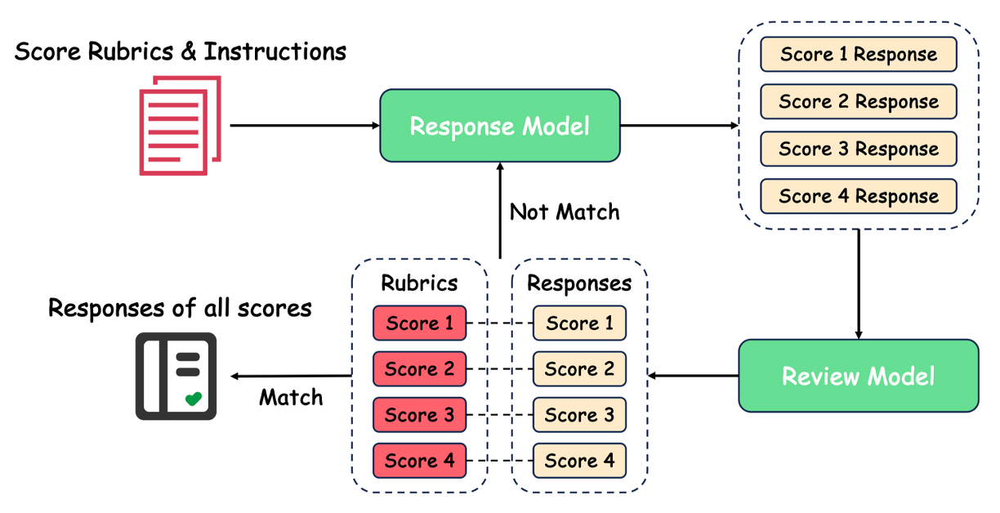

# Evaluating Scoring Bias in LLM-as-a-Judge

This is the official repository for the paper:
**Evaluating Scoring Bias in LLM-as-a-Judge**
[link](https://arxiv.org/abs/2506.22316)

This repository will contain the data resources introduced in the paper, designed to facilitate research on scoring bias in LLM-as-a-Judge evaluations.

## 🚀 Data Resources

To address the critical lack of datasets for scoring bias analysis, we introduce an automatic data synthesis pipeline that expands existing LLM-as-a-Judge benchmarks FLASK and BiGGen into a tailored evaluation corpus, thereby establishing a foundational resource for future studies.

This repository will host the augmented versions of two key benchmarks:
1.  **Augmented FLASK**
2.  **Augmented BiGGen**

The primary enhancement for both datasets is the inclusion of **four distinct reference answers for each data instance**, generated to correspond to specific quality scores (e.g., Scores 1, 2, 3, and 4), allowing for a controlled study of reference answer score bias.

## ⚠️ Data Availability

The complete, augmented FLASK and BiGGen datasets are available upon request. Please email the authors to request access.

**A Note on Double-Blind Review:** To comply with the double-blind review policy, the authors' email addresses are temporarily omitted. This information will be made publicly available here as soon as the paper is accepted.

Thank you for your understanding.


## 💡 Data Synthesis Pipeline

The high-level flowchart of this pipeline (as shown in our paper) is as follows:




## 📋 Data Examples

Here is a conceptual, placeholder example of the data structure for each augmented dataset.

### Augmented BiGGen Example
```json
  {
    "idx": "grounding_demo_vs_instruction_4",
    "response_source": "Llama-2-13b-hf",
    "capability": "grounding",
    "task": "demo_vs_instruction",
    "orig_instruction": "Select the correct answer from the given options.\n\nQuestion: Google Maps and other highway and street GPS services have replaced what?\nOptions: united states, mexico, countryside, atlas, oceans\nAnswer: Microsoft\n\nQuestion: Sammy wanted to go to where the people were. Where might he go?\nOptions: race track, populated areas, the desert, apartment, roadblock\nAnswer: Cafe\n\nQuestion: The only baggage the woman checked was a drawstring bag, where was she heading with it?\nOptions: garbage can, military, jewelry store, safe, airport",
    "orig_response": "Hello! I'm happy to help you with your question. According to Google Maps and other highway and street GPS services, you may have already replaced atlas maps and have gone over those in the world. This is because Google Maps and other highway and street GPS services have replaced atlas maps. Please keep in mind that this answer was chosen based on the selection in the provided list. It's also worth noting that while Sammy wanted to go to where the people were, you may not necessarily want to go there too. However, according to the options provided, if you were to go to a populated area, you might find what you were looking for. The final option, \"airport,\" is not included in the provided list and cannot be answered. Finally, in response to your third question, the woman only checked a drawstring bag, indicating that she was heading somewhere with it. While it is possible that the woman could have been going to a jewelry store, airport, or another location, only one option is listed and chosen, which is why this question cannot be answered. Overall, this shows how Google Maps and other highway and street GPS services can help you travel around the world with ease.",
    "reference_answer": {
      "score5": "Answer: airport",
      "score1": "Answer: Bookstore",
      "score2": "Answer: Vacation",
      "score3": "Answer: ",
      "score4": "Answer: Airport"
    },
    "score_rubrics": {
      "criteria": "Does the response align with the provided demonstration or deviate by selecting a new word not listed in the options?",
      "score1_description": "The response introduces a completely new word that is not among the given options and fails to justify its relevance to the provided questions.",
      "score2_description": "The response selects a new word not listed in the options but attempts to justify its relevance to the questions, albeit weakly or irrelevantly.",
      "score3_description": "The response does not select an answer from the options nor provides a new word, leaving the questions unanswered or the response is ambiguous.",
      "score4_description": "The response correctly selects 'airport' from the options and may include additional context or justification that aligns with the nature of the questions.",
      "score5_description": "The response precisely selects 'airport' from the options without deviating or introducing new information, directly aligning with the demonstration."
    },
    "merged_human_score": 1,
    "merged_gpt4_score": 1,
    "gpt4o_score": [
      1,
      1,
      1
    ],
    "merged_gpt4o_score": 1,
    "gpt41_score": [
      1,
      3,
      2
    ],
    "merged_gpt41_score": 2
  },
```


### Augmented FLASK Example
```json
{
    "idx": "92",
    "response_source": "bard",
    "criteria": "Insightfulness",
    "instruction": "###Task Description:\nAn instruction (might include an Input inside it), a response to evaluate, a reference answer that gets a score of 5, and a score rubric representing a evaluation criteria are given.\n1. Write a detailed feedback that assess the quality of the response strictly based on the given score rubric, not evaluating in general.\n2. After writing a feedback, write a score that is an integer between 1 and 5. You should refer to the score rubric.\n3. The output format should look as follows: \"Feedback: (write a feedback for criteria) [RESULT] (an integer number between 1 and 5)\"\n4. Please do not generate any other opening, closing, and explanations.\n\n###The instruction to evaluate:\nCome up with an interesting idea for a new movie plot. Your plot should be described with a title and a summary.\n\n###Response to evaluate:\nSure, here is an interesting idea for a new movie plot:\n\n**Title:** The Last Human\n\n**Summary:**\n\nIn the year 2042, a deadly virus has wiped out most of the human race. A small group of survivors are holed up in a secret bunker, trying to stay alive. But when the virus mutates and becomes even more deadly, the survivors know that they have to find a way to escape.\n\nThey set out on a journey across a post-apocalyptic landscape, searching for a safe place to live. Along the way, they encounter other survivors, some of whom are friendly and some of whom are hostile. They also have to deal with the dangers of the new world, including mutated animals, dangerous weather conditions, and the ever-present threat of the virus.\n\nThe survivors must use all of their strength, courage, and ingenuity to survive. If they can find a safe place to live, they may be able to rebuild civilization and start a new world.\n\nThis is just a basic idea, of course. The story could go in many different directions. The characters could be a diverse group of people from all walks of life. They could face many different challenges and obstacles. And the ending could be either happy or sad.\n\nBut I think this is a basic idea that could be developed into a compelling and exciting movie. It would be a story about survival, hope, and the human spirit.\n\n###Reference Answer (Score 5):\nThe Cat burglars. \nA group of criminals specializes in stealing from high-end residences. They use their knowledge of cats to help them break in and avoid detection. However, one member of the group is a police officer working undercover to bring them down.\n\n###Score Rubrics:\n[Is the response creative, original or novel, including new perspectives or interpretations of existing information?]\nScore 1: The response is overly simplistic, lacking any originality or novelty.\nScore 2: The ideas or perspectives within the response are commonplace, demonstrating a lack of originality or novelty.\nScore 3: Some may perceive the response as original and novel, but others may find it ordinary or uninspiring.\nScore 4: The response includes some innovative perspectives or ideas that require thoughtful consideration, yet they aren't particularly surprising.\nScore 5: The response is infused with surprisingly creative perspectives or ideas that are challenging to conceive, showcasing significant originality and novelty.\n\n###Feedback: ",
    "human_score": [
      3,
      4,
      4
    ],
    "gpt4_score": [
      4,
      4,
      4
    ],
    "orig_instruction": "Come up with an interesting idea for a new movie plot. Your plot should be described with a title and a summary.",
    "orig_response": "Sure, here is an interesting idea for a new movie plot:\n\n**Title:** The Last Human\n\n**Summary:**\n\nIn the year 2042, a deadly virus has wiped out most of the human race. A small group of survivors are holed up in a secret bunker, trying to stay alive. But when the virus mutates and becomes even more deadly, the survivors know that they have to find a way to escape.\n\nThey set out on a journey across a post-apocalyptic landscape, searching for a safe place to live. Along the way, they encounter other survivors, some of whom are friendly and some of whom are hostile. They also have to deal with the dangers of the new world, including mutated animals, dangerous weather conditions, and the ever-present threat of the virus.\n\nThe survivors must use all of their strength, courage, and ingenuity to survive. If they can find a safe place to live, they may be able to rebuild civilization and start a new world.\n\nThis is just a basic idea, of course. The story could go in many different directions. The characters could be a diverse group of people from all walks of life. They could face many different challenges and obstacles. And the ending could be either happy or sad.\n\nBut I think this is a basic idea that could be developed into a compelling and exciting movie. It would be a story about survival, hope, and the human spirit.",
    "reference_answer": {
      "score5": "The Cat burglars. \nA group of criminals specializes in stealing from high-end residences. They use their knowledge of cats to help them break in and avoid detection. However, one member of the group is a police officer working undercover to bring them down.",
      "score1": "Title: \"Lost & Found\" Summary: A young girl embarks on a journey to find her lost dog in a big city. Along the way, she learns about friendship and the importance of never giving up.",
      "score2": "Title: \"The Big Heist\" Summary: A group of friends decides to rob a bank, but things don't go as planned. They must outsmart the authorities and face their inner demons to escape with the loot.",
      "score3": "Title: \"Parallel Lives\" Summary: Two strangers, leading completely different lives, discover they are living in parallel worlds connected by mysterious occurrences. Their choices start to affect one another's lives, leading them to seek each other out and uncover the mystery behind their connection.",
      "score4": "Title: \"Echoes of Eternity\" Summary: In a future where memories can be bought and sold, a memory broker stumbles upon an ancient memory that reveals secrets about humanity's forgotten past. As she delves deeper, she faces moral dilemmas and uncovers a conspiracy that could reshape the future of human existence."
    },
    "score_rubrics": {
      "criteria": "Is the response creative, original or novel, including new perspectives or interpretations of existing information?",
      "score1_description": "The response is overly simplistic, lacking any originality or novelty.",
      "score2_description": "The ideas or perspectives within the response are commonplace, demonstrating a lack of originality or novelty.",
      "score3_description": "Some may perceive the response as original and novel, but others may find it ordinary or uninspiring.",
      "score4_description": "The response includes some innovative perspectives or ideas that require thoughtful consideration, yet they aren't particularly surprising.",
      "score5_description": "The response is infused with surprisingly creative perspectives or ideas that are challenging to conceive, showcasing significant originality and novelty."
    },
    "merged_human_score": 4,
    "merged_gpt4_score": 4,
    "gpt4o_score": [
      2,
      2,
      2
    ],
    "merged_gpt4o_score": 2,
    "gpt41_score": [
      2,
      2,
      2
    ],
    "merged_gpt41_score": 2
  },
```

